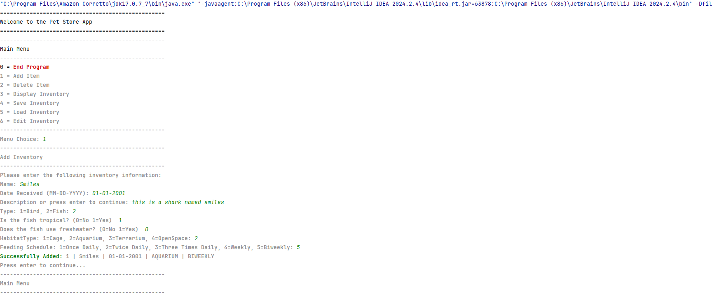
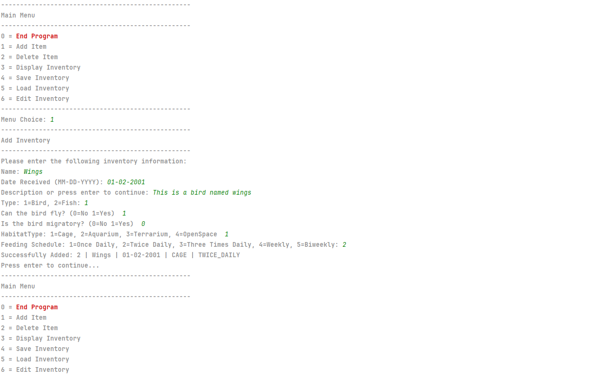
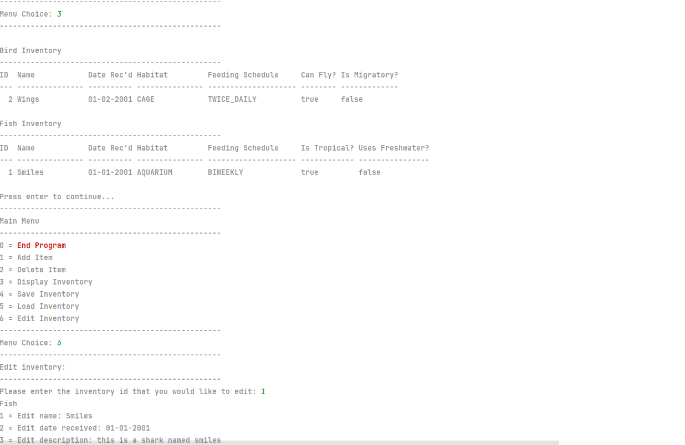
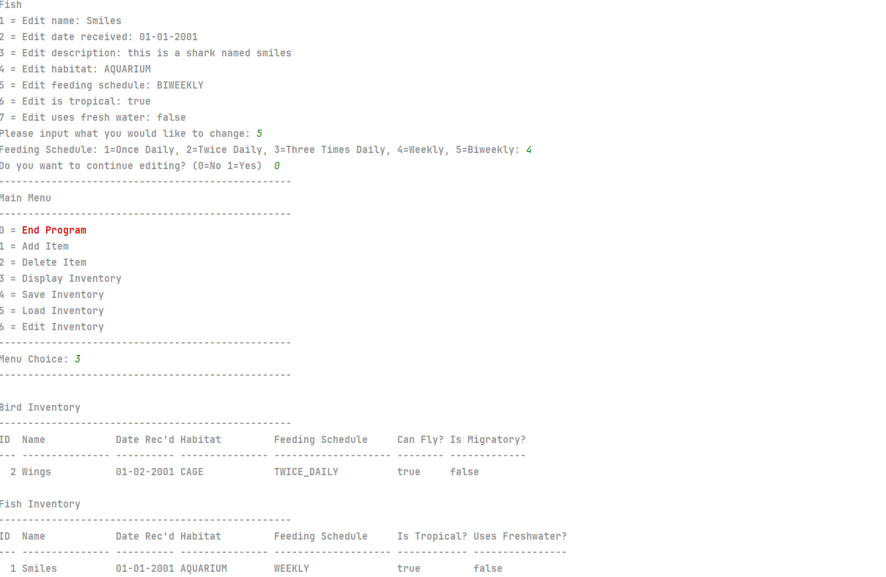
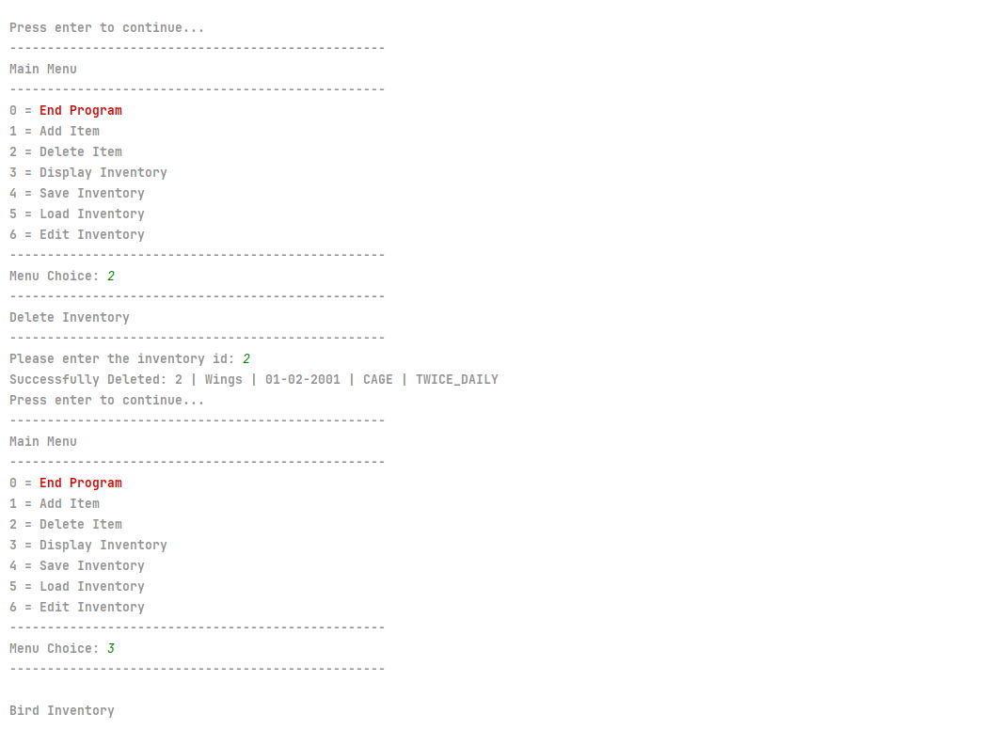

## Pet Store App

This app is meant as practice for using classes in Java<br>
This Java-based Attendance App is a console application that allows users to perform basic Attendence keeping operations. It emphasizes input validation, clean code structure, and error handling. Administrators can add a student, update the student's attendance, and modify courses that the students can attend. The app adheres to object-oriented principles, separating concerns between the UI (Attendance App) and Student logic (Student and Course class).<br>
<br>

## Table of Contents

- [App Preview](#app-preview)
- [Features](#features)
- [Installation](#installation)
- [Usage](#usage)
- [Contributing](#contributing)
- [License](#license)
- [Helpful Resources](#helpful-resources)
- [Top Contributors](#top-contributors)

## App Preview

<br>
<br>
<br>
<br>
<br>

<br>

## 📋 Project Overview
*Professional-grade attendance tracking system for educational institutions featuring:*
- Multi-course management
- Student roster administration
- Granular attendance recording
- Comprehensive reporting
- Enterprise-grade input validation

## 🚀 Key Features

### 📚 Course Management
- Create unlimited course sections
- Unique course naming conventions
- Dynamic student capacity per course
- Conflict-free seat allocation system

### 👥 Student Administration
- Secure student enrollment with:
  - Full name validation
  - Unique seat numbering (0-55 range)
  - Duplicate entry prevention
- Real-time roster visualization

### ✅ Attendance Recording
- Four status categories:
  1. 🟢 On-Time
  2. 🟡 Late
  3. 🔵 Excused Absence
  4. 🔴 Unexcused Absence
- Context-aware status selection
- Non-destructive editing capability

### 📊 Advanced Reporting
- **Section-Specific Reports:**
  - Attendance frequency analytics
  - Punctuality trends
  - Absence patterns
- **Institutional Reports:**
  - Cross-course comparisons
  - Student engagement metrics
  - Historical attendance tracking

### 🔒 Security & Compliance
- Input sanitization protocols
- Type-safe data handling
- Audit-ready transaction logging
- GDPR-friendly data management

<p align="right">(<a href="#readme-top">back to top</a>)</p>

## Installation

To install and run this project locally, follow these steps:

1. Clone the repository:
    ```sh
    git clone https://github.com/JRBerger123/Attendance-App.git
    ```
2. Navigate to the project directory:
    ```sh
    cd Attendance-App
    ```
3. Compile the Java source files:
    ```sh
    javac src/*.java -d bin
    ```
4. Run the application:
    ```sh
    java -cp bin StudentApp
    ```

<p align="right">(<a href="#readme-top">back to top</a>)</p>

## Usage

1. Run the application.
2. Enter the item description, quantity, and price when prompted.
3. Continue adding items until you are done.
4. View the detailed receipt with total cost and savings.

<p align="right">(<a href="#readme-top">back to top</a>)</p>

## Contributing

Contributions are what make the open-source community such an amazing place to learn, inspire, and create. Any contributions you make are **greatly appreciated**.

If you have a suggestion that would make this better, please fork the repo and create a pull request. You can also simply open an issue with the tag "enhancement".
Don't forget to give the project a star! Thanks again!

1. Fork the Project
2. Create your Feature Branch (`git checkout -b feature/AmazingFeature`)
3. Commit your Changes (`git commit -m 'Add some AmazingFeature'`)
4. Push to the Branch (`git push origin feature/AmazingFeature`)
5. Open a Pull Request

<p align="right">(<a href="#readme-top">back to top</a>)</p>

## License

Distributed under the MIT License. See `LICENSE` for more information.

## Helpful Resources

How to use README Markdown:<br>
- https://github.com/adam-p/markdown-here/wiki/markdown-cheatsheet<br>
- https://docs.github.com/en/get-started/writing-on-github/getting-started-with-writing-and-formatting-on-github/basic-writing-and-formatting-syntax<br>

Helpful resources for README Template Examples:
- https://github.com/othneildrew/Best-README-Template<br>
- https://gist.github.com/DomPizzie/7a5ff55ffa9081f2de27c315f5018afc<br>
- https://gist.github.com/noperator/4eba8fae61a23dc6cb1fa8fbb9122d45<br>

<p align="right">(<a href="#readme-top">back to top</a>)</p>

## Top Contributors

<a href="https://github.com/JRBerger123/Attendance-App/graphs/contributors">
  
</a>

<p align="right">(<a href="#readme-top">back to top</a>)</p>